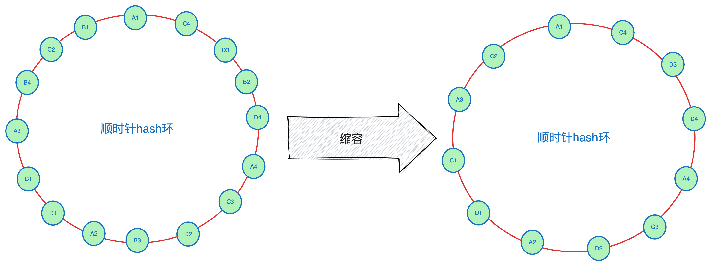

<!--more-->

## 负载均衡算法
在分布式系统中，一般来说会有多台机器，机器可能会分布在不同的集群，客户端的一个请求经过服务注册中心或者网关，注册中心或者网关会根据负载均衡算法将本次请求分发到某台具体的服务器，负载均衡算法主要用于分配网络或计算资源，以优化响应时间和避免过度负载任何一个资源常见的有如下的负载均衡算法：
负载均衡算法主要用于分配网络或计算资源，以优化响应时间和避免过度负载任何一个资源。以下是一些常见的负载均衡算法：

1. **轮询（Round Robin）**：这是最简单的负载均衡算法，它将请求按顺序分配给服务器。当到达最后一个服务器时，算法会返回到队列的顶部并重新开始。

2. **加权轮询（Weighted Round Robin）**：这是轮询的一个变种，它考虑到了服务器的处理能力。每个服务器都被分配一个权重，权重较高的服务器将接收更多的请求。

3. **最少连接（Least Connections）**：这种算法将新的请求分配给当前连接数最少的服务器。这对于处理时间较长的请求非常有效。

4. **加权最少连接（Weighted Least Connections）**：这是最少连接算法的一个变种，它考虑到了服务器的处理能力。每个服务器都被分配一个权重，权重较高的服务器将接收更多的请求。

5. **随机（Random）**：这种算法将请求随机分配给服务器。

6. **最短响应时间（Least Response Time）**：这种算法将请求分配给响应时间最短的服务器。

7. **普通哈希（Hash）**：这种算法根据源IP地址或者请求入参的哈希值来分配请求。这样可以保证来自同一源IP地址或者同一个请求总是被分配给同一台服务器。

8. **一致性哈希（Consistent Hashing）**：对普通Hash算法的一个改进，这种算法主要用于分布式系统，它可以在服务器集群的数量发生变化时，最小化重新分配的数据。

设想我们有这样一个场景：有一个分布式服务，我们需要为这个服务构造一个本地缓存，当服务的机器数很多的时候，同一个key可能在多台机器上都会有缓存，如果要缓存的数据量很大的时候，同一台机器上key过多可能会导致机器内存占用率过高，严重的可能会发生OOM，这就要求缓存的key散列的分布在不同的机器上，减少单台机器的负载，需要构造一个请求入参和机器的映射关系，让相同的请求打到相同的机器上。应该采用上述何种算法提高缓存的命中率并减少缓存占用空间呢？1-6的算法，一个请求打到哪台服务器随机性很大，7-8都是hash算法，如果把请求入参hash，理论上可以保证同样的请求达到同样的机器上的。


如上图所示，假设这个服务有A/B/C/D四台机器，每台机器负责一部分请求，和普通的hash算法不同的是，一致性hash把一个结点化整为零拆分成多个`虚拟子结点`，所有机器的子结点构成了一个环，按照子结点负责的hash值进行排序，这样做的主要有两个好处：一是让请求更加离散最大程度上减少请求聚集避免单点承载过重，二是在发生扩缩容请求调度的时候能够以较小的代价完成调度的过程。
## 代码实现
```go
package main

import (
	"crypto/rand"
	"encoding/hex"
	"fmt"
	"hash/fnv"
	"net"
	"sort"
	"sync"
)

const (
	keySize    = 1000
	traceIDLen = 16
	ringSize   = 100
)

func main() {
	hr := NewHashRing([]ServerNode{
		{
			Name:   "grpc.app.server1.service1",
			Weight: 0.89,
		},
		{
			IP: net.ParseIP("123.33.32.1"), Port: 8932,
			Weight: 0.73,
		},
		{
			IP: net.ParseIP("123.33.32.1"), Port: 8933,
		},
		{
			IP: net.ParseIP("234.65.32.3"), Port: 8932,
			Weight: 1,
		},
		{
			IP: net.ParseIP("231.23.32.11"), Port: 32322,
			Weight: 1.11,
		},
	})
	keys := make([]string, keySize*2)
	for i := 0; i < keySize; i++ {
		keys[i] = generateTraceID()
		keys[2*keySize-i-1] = keys[i]
	}
	for _, key := range keys {
		fmt.Printf("%s:%s\n", key, hr.GetNode(key))
	}
	fmt.Println("AddNodes====================")
	hr.AddNodes(
		ServerNode{IP: net.ParseIP("132.232.123.223"), Port: 1923, Weight: 0.91},
		ServerNode{Name: "trpc.app.server2.service1", Weight: 1.21},
	)
	for _, key := range keys {
		fmt.Printf("%s:%s\n", key, hr.GetNode(key))
	}
	fmt.Println("RemoveNodes====================")
	hr.RemoveNodes(hr.GetNode(keys[0]), hr.GetNode(keys[1]), hr.GetNode(keys[3]))
	for _, key := range keys {
		fmt.Printf("%s:%s\n", key, hr.GetNode(key))
	}
}

// HashRing 哈希环
// nodes  真实结点
// virtualNodes n个虚拟节点指向一个实际节点,一个实体节点变成n个虚拟结点，均匀打散。
type HashRing struct {
	nodes        map[string]ServerNode
	virtualNodes map[uint32]ServerNode
	sortedHashes []uint32
	mu           sync.RWMutex
}

// ServerNode 服务器结点信息
type ServerNode struct {
	Name   string  // 服务名
	IP     net.IP  // ip地址
	Port   uint16  // 端口
	Weight float32 // 权重
}

// NewHashRing 新建一个hash环
func NewHashRing(nodes []ServerNode) *HashRing {
	ns := make(map[string]ServerNode, len(nodes))
	for _, nd := range nodes {
		ns[nd.String()] = nd
	}

	hr := &HashRing{nodes: ns, virtualNodes: map[uint32]ServerNode{}}
	hr.virtualNodes = hr.generateVirtualNodes()
	hr.sortedHashes = hr.genSortedHashes()
	hr.mu = sync.RWMutex{}
	return hr
}

// AddNodes 添加结点
func (h *HashRing) AddNodes(nodes ...ServerNode) {
	h.mu.Lock()
	defer h.mu.Unlock()
	for _, node := range nodes {
		if _, ok := h.nodes[node.String()]; ok {
			continue
		}
		h.nodes[node.String()] = node
		h.addVirtualNodes(node)
	}
	h.sortedHashes = h.genSortedHashes()
}

// RemoveNodes 移除结点
func (h *HashRing) RemoveNodes(nodes ...ServerNode) {
	h.mu.Lock()
	defer h.mu.Unlock()
	for _, node := range nodes {
		delete(h.nodes, node.String())
		h.deleteVirtualNodes(node)
	}
	h.sortedHashes = h.genSortedHashes()
}

// GetNode 获取结点
func (h *HashRing) GetNode(key string) ServerNode {
	h.mu.RLock() // Use read lock instead of write lock
	defer h.mu.RUnlock()
	if len(h.virtualNodes) == 0 {
		return ServerNode{}
	}
	hashValue := hash(key)
	if h.sortedHashes[len(h.sortedHashes)-1] < hashValue {
		return h.virtualNodes[h.sortedHashes[0]]
	}
	i, j := 0, len(h.sortedHashes)-1
	for i < j {
		mid := i + (j-i)/2
		if h.sortedHashes[mid] >= hashValue {
			j = mid
		} else {
			i = mid + 1
		}
	}
	if h.sortedHashes[i] >= hashValue {
		return h.virtualNodes[h.sortedHashes[i]]
	}
	return h.virtualNodes[h.sortedHashes[0]]
}

func (h *HashRing) generateVirtualNodes() map[uint32]ServerNode {
	virtualNodes := make(map[uint32]ServerNode)
	for _, node := range h.nodes {
		for i := 0; i < int(ringSize*node.Weight); i++ {
			virtualNode := fmt.Sprintf("%s#%d", node, i)
			virtualNodes[hash(virtualNode)] = node
		}
	}
	return virtualNodes
}

func (h *HashRing) addVirtualNodes(node ServerNode) {
	for i := 0; i < int(ringSize*node.Weight); i++ {
		virtualNode := fmt.Sprintf("%s#%d", node, i)
		h.virtualNodes[hash(virtualNode)] = node
	}
}

func (h *HashRing) deleteVirtualNodes(node ServerNode) {
	for i := 0; i < int(ringSize*node.Weight); i++ {
		delete(h.virtualNodes, hash(fmt.Sprintf("%s#%d", node, i)))
	}
}

func (h *HashRing) genSortedHashes() []uint32 {
	hashes := make([]uint32, 0, len(h.virtualNodes))
	for node := range h.virtualNodes {
		hashes = append(hashes, node)
	}
	sort.Slice(hashes, func(i, j int) bool {
		return hashes[i] < hashes[j]
	})
	return hashes
}

func hash(key string) uint32 {
	h := fnv.New32a()
	_, _ = h.Write([]byte(key))
	return h.Sum32()
}

func (s ServerNode) equal(node ServerNode) bool {
	if len(s.Name) > 0 && len(node.Name) > 0 && s.Name == node.Name {
		return true
	}
	if len(s.IP) == 0 || s.Port == 0 || len(node.IP) == 0 || node.Port == 0 {
		return false
	}
	return s.IP.Equal(node.IP) && s.Port == node.Port
}

func (s ServerNode) String() string {
	if len(s.Name) != 0 {
		return fmt.Sprintf("target://%s", s.Name)
	}
	return fmt.Sprintf("IP://%s:%d", s.IP, s.Port)
}

func generateTraceID() string {
	traceID := make([]byte, traceIDLen)
	_, err := rand.Read(traceID)
	if err != nil {
		panic(err)
	}
	return hex.EncodeToString(traceID)
}

```

## 调度过程

在服务扩容或缩容的过程中，请求的转移是不可避免的。这个过程类似于Kafka的rebalance操作，即重新调度资源分配。然而，Kafka的rebalance过程的一个缺点是它相对较慢，这是由于Kafka的高吞吐量和高可用性所决定的。一致性哈希算法的优点在于整个`rebalance`过程会非常快，这样可以更好地应对服务请求量波动导致的扩缩容。

### 服务扩容

假设我们现在有A、B、C和D四台机器，通过一致性哈希算法，每台机器负责一部分的请求。当流量增加或出现热点问题导致请求量增加时，服务会自动扩容出一台新的机器E。在这个过程中，调度机制会首先计算E机器对应的虚拟节点负责的哈希范围，然后通过插入排序的方式，将新的虚拟节点插入到已有的哈希环中。最后，更新服务的路由信息，使得新的请求逐步平滑地从原有节点迁移到新扩容出来的节点。整个过程如下：

1. 计算新机器E对应的虚拟节点负责的哈希范围。
2. 将新的虚拟节点插入到已有的哈希环中，使用插入排序的方式。
3. 更新服务的路由信息，使得新的请求逐步平滑地从原有节点迁移到新扩容出来的节点。


通过这种方式，一致性哈希算法可以快速地进行服务扩容，更好地应对服务请求量波动导致的扩缩容。

### 服务缩容
上面介绍了扩容的过程，缩容过程与扩容相似。假设B机器因为长期低负载和较小的请求量触发了缩容策略，导致机器被回收。在这种情况下，调度机制会在哈希环中移除所有与B机器相关的虚拟节点，并更新路由信息。此时，原先B服务器虚拟节点负责的请求哈希范围会均匀地分散到其他机器的虚拟节点上。

由于整个哈希环中，如果哈希算法足够均匀，那么A、B、C和D四台机器对应的虚拟节点也是离散分布的。这样，在缩容后，剩下的三台机器不会出现某台机器承载过重的情况，从而避免了雪崩效应。通过这种方式，一致性哈希算法在服务缩容过程中能够快速地进行资源调度，确保系统的稳定性和可用性。



### 小结
一致性hash算法调度过程的关键点如下：

1. 一致性哈希算法在服务扩容和缩容过程中能够快速地进行资源调度，以应对服务请求量波动导致的扩缩容。
2. 在扩容过程中，新的虚拟节点会被插入到已有的哈希环中，并更新路由信息，使得新的请求逐步平滑地从原有节点迁移到新扩容出来的节点。
3. 在缩容过程中，被回收机器的虚拟节点会从哈希环中移除，并更新路由信息，使得原先负责的请求哈希范围均匀地分散到其他机器的虚拟节点上。
4. 一致性哈希算法通过离散分布的虚拟节点，确保在扩缩容过程中不会出现某台机器承载过重的情况，从而避免了雪崩效应。

## 实际应用
一致性哈希算法在实际应用中有很多场景，以下是一些常见的应用：

1. 分布式缓存：在分布式缓存系统（如Redis、Memcached）中，一致性哈希算法被用于将缓存数据分布在多个缓存节点上。当缓存节点发生扩容或缩容时，一致性哈希算法能够保证数据重新分布的过程中，尽量减少数据迁移的数量，从而降低缓存失效的概率。

2. 负载均衡：在分布式系统中，负载均衡器（如Nginx、HAProxy）可以使用一致性哈希算法将客户端请求分发到不同的服务器上。这样，在服务器扩容或缩容时，可以保证客户端请求的重新分配过程更加平滑，避免某些服务器过载。

3. 分布式存储：在分布式存储系统（如Cassandra、HBase）中，一致性哈希算法被用于将数据分片存储在多个节点上。当存储节点发生扩容或缩容时，一致性哈希算法能够保证数据重新分布的过程中，尽量减少数据迁移的数量，从而降低数据不一致的风险。

4. 分布式锁：在分布式锁系统（如ZooKeeper、etcd）中，一致性哈希算法可以用于将锁资源分布在多个锁服务器上。这样，在锁服务器扩容或缩容时，可以保证锁资源的重新分配过程更加平滑，避免某些锁服务器过载。

一致性哈希算法在实际应用中有很多场景，主要用于解决分布式系统中的数据分布、负载均衡和动态扩缩容等问题。