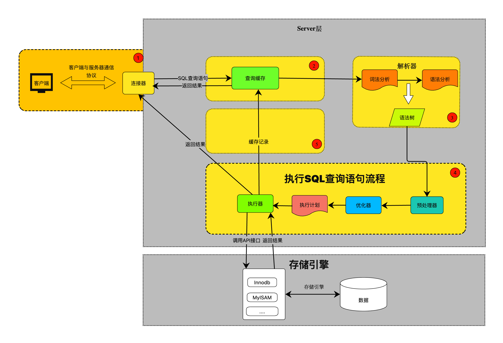

<!--more-->

# MySQL
介绍MySQL的一些核心概念以及它们的底层实现,以下都是基于MySQL的InnoDB存储引擎。
## SQL语句执行流程
我们刚开始学习SQL的时候，第一个学的就是select语句了，以下就是一条最简单的查询语句:
```SQL
// 在student表中查询一条id为1的记录
select * from student where id=1;
```
那么执行这条SQL语句的全流程是什么呢？`MySQL内部执行这条简单的SQL语句都做了哪些事，内部发生了什么呢？`带着疑问开始学习MySQL，了解MySQL的内部架构。
先从全局的角度来看一条SQL语句的执行流程，从图中可以看到SQL语句从客户端到到数据存储整个流程以及MySQL的架构所包含的模块。



可以看到MySQL内部分为两层，`Server层和存储引擎层`。
- `Server层负责建立和客户端连接、分析、优化和执行SQL语句。`Server层和存储引擎无关，MySQL的核心模块都是在Server层实现，包括连接器、解析器、预处理器、优化器、执行器，此外MySQL的内置函数和所有跨存储引擎的功能都是在Server层实现/。
- `存储引擎层负责数据的提取和存储。`存储引擎有多重，常见的有InnoDB、MyISAM、Memory，提供给Server层的接口都是一样的，只是具体实现不同。本文主要就InnodDB存储引擎展开，InnoDB也是MySQL的默认存储引擎。我们熟悉的MySQL的一些概念，如索引、事务、锁等都是在存储引擎层实现的，InnoDB的索引类型是B+树，我们在数据库表中创建的主键索引、联合索引、普通索引等都是用的B+树索引

以上介绍了一下MySQL的整体架构，总的架构来说“不算复杂”，就Server层和存储引擎层，下面就具体细节展开。
### 连接器
如果想要对MySQL进行增删改查操作，首先肯定是要和MySQL建立连接才能继续接下来的操作，一般使用如下命令和MySQL服务建立连接。
```shell
# -h 指定域名或者ip地址
# -u 指定用户名
# -p 指定密码，从风险角度考量一般不写死，而是在执行命令后手动在控制台输入
mysql -h ip -u user -p
如：
mysql -h 192.168.1.111 -u root -p 
```
因为MySQL的的传输层协议是基于TCP的，所以建立连接的过程需要经过TCP三次握手。如果MySQL服务器运行正常，在建立TCP连接后，会验证我们的用户名和密码是否正确，如果用户名或者密码不对，就会报错：`Access denied for user`。如果用户名和密码都是ok的，连接器就会根据用户名查询改用户具有的权限，把权限保存在内存里，在改次连接断开之前，即便是管理员修改了用户的权限，也不会影响用户在本次连接的权限，只会在下次建立连接的时候才会使用新的权限，在本次连接生命周期中，用户的所有读写操作的权限都是基于认证的时候保存在内存的权限。
可以使用如下命令查看当前mysql服务器建立的脸颊情况
```MySQL
mysql> show processlist;
+----------+------+--------------------+-------------+---------+------+-------+------------------+
| Id       | User | Host               | db          | Command | Time | State | Info             |
+----------+------+--------------------+-------------+---------+------+-------+------------------+
| 10773010 | root | 10.99.17.131:21086 | NULL        | Sleep   |  210 |       | NULL             |
| 10773094 | root | 10.99.17.131:23980 | mysql_learn | Sleep   |   72 |       | NULL             |
| 10773150 | root | 10.99.17.131:25924 | NULL        | Query   |    0 | init  | show processlist |
+----------+------+--------------------+-------------+---------+------+-------+------------------+
3 rows in set (0.02 sec)
```
可以看到,有三个用户名为root的用户和MySQL服务建立了连接，其中Id为10773010的用户使用的db是空而且`Commond`的值是Sleep，意味着该用户执行连接命令后没有再执行过其它任何命令，并且空闲等待的时间为210s（Time列）
> 那么这个空闲等待时间会一直无限递增吗？换句话说MySQL连接会一直保存着吗？

肯定是不可能的，不可能我一年前建立的一个连接然后忘了啥都没干，但是MySQL还记着一直给我保存着，显然这是不可能的（就好比去餐厅吃饭，预约了一个座位，超过一定时间没去肯定会给你取消的），MySQL也有类似的机制，如果一个连接长期在哪空转啥都不干，超过一定时间内就会自动断开，这个断开时间（最大空闲时常）是由 `wait_timeout`这个参数控制的，默认的是2*60*60=7200s。
```MySQL
mysql> show variables like 'wait_timeout';
+---------------+-------+
| Variable_name | Value |
+---------------+-------+
| wait_timeout  | 7200  |
+---------------+-------+
1 row in set (0.03 sec)

```
如果我们看某个连接不爽，也可以使用 `kill connection +Id`命令手动kill这个连接，我现在想要干掉10773010这个连接，只需要执行如下命令：
```MySQL
mysql> kill connection +10773010;
Query OK, 0 rows affected (0.02 sec)

mysql> show processlist;
+----------+------+--------------------+-------------+---------+------+-------+------------------+
| Id       | User | Host               | db          | Command | Time | State | Info             |
+----------+------+--------------------+-------------+---------+------+-------+------------------+
| 10773094 | root | 10.99.17.131:23980 | mysql_learn | Sleep   |  895 |       | NULL             |
| 10773150 | root | 10.99.17.131:25924 | NULL        | Query   |    0 | init  | show processlist |
+----------+------+--------------------+-------------+---------+------+-------+------------------+
2 rows in set (0.03 sec)

mysql>
```
可以看到10773010这个连接已经被kill掉了

> 可以无限和MySQL服务器建立连接吗？

就像任何资源都是有上限的，MySQL的连接也是宝贵的资源，肯定不会也不能无限提供，就像最大空闲市场是由`wait_timeout`这个参数控制的一样，最大连接数是由 `max_connections`参数控制的

```MySQL
mysql> show variables like 'max_connections';
+-----------------+-------+
| Variable_name   | Value |
+-----------------+-------+
| max_connections | 2500  |
+-----------------+-------+
1 row in set (0.03 sec)

mysql>

```
比如我的MySQL服务器的最大连接数是2500，意味着在同一时刻最多只能保持2500个连接，超过这个值，系统会拒绝接下来的连接请求，并且报错`Too many connections`。

我们知道HTTP协议是基于TCP协议的，HTTP有长连接和短连接，同样的MySQL也有长连接和短连接。
- 长连接：顾名思义，存活周期很长的连接，客户端在和MySQL建立连接后，每次执行完一条SQL语句，连接不会马上释放，而是保存着，下次再执行SQL语句不用重复建连了，而是可以复用这条连接。
- 短连接：故名思义，存活周期较短的连接，客户端在和MySQL建立连接后，每次执行完一条SQL语句，连接马上释放，下次再执行SQL语句需要重新建连。
```shell
# 长连接
经过tcp三次握手和MySQL建立连接
执行sql1
执行sql2
执行sql3
....
执行sqln
经过tcp四次挥手和MySQL断开链接。

# 短连接
经过tcp三次握手和MySQL建立连接
执行sql1
经过tcp四次挥手和MySQL断开链接。

经过tcp三次握手和MySQL建立连接
执行sql2
经过tcp四次挥手和MySQL断开链接。

经过tcp三次握手和MySQL建立连接
执行sql3
经过tcp四次挥手和MySQL断开链接。
....
经过tcp三次握手和MySQL建立连接
执行sqln
经过tcp四次挥手和MySQL断开链接。

```
可以看到长连接和短连接各有优劣。
长连接的好处在于不用每次执行SQL语句都建立连接，做到资源复用，而且可以降低SQL语句耗时（省去建立连接的三次握手过程）；坏处在于连接长期得不到释放，连接是需要占用MySQL的系统资源的，如果长连接累积的很多，可能会导致MySQL系统OOM，所以最大连接数不能配置的太高。
短连接的好处在于每次执行完SQL语句连接都被释放掉了，降低MySQL系统负载，坏处是每次执行SQL语句都需要建立连接，会增加SQL语句执行耗时。

在实际开发过程中，一般推荐使用长连接，因为可以减少建连和断连的过程，但是长连接过多可能会导致MySQL系统高负载，导致服务异常重启。

> 长连接长期不释放，MySQL系统内存会占用很大，如何解决？

一般来说，有以下几种解决方式：
- `设置合理的超时时间`在MySQL服务器和客户端之间建立长连接时，可以设置合理的超时时间。通过配置wait_timeout和interactive_timeout参数，可以控制连接在闲置一段时间后自动关闭。这样可以确保长时间不活跃的连接被释放，释放相关的资源。
- `使用连接池`使用连接池管理连接是一种常见的解决方案。连接池可以维护一组预先创建的连接，并在需要时分配给客户端。连接池会复用连接，避免频繁地创建和销毁连接，从而减少资源消耗。连接池通常还提供连接的管理和监控功能，可以根据需求配置连接的最大数量、超时时间等参数。
- `显式关闭连接`在编写应用程序代码时，确保在不再需要连接时显式关闭连接。这样可以确保连接在使用完毕后及时释放，避免资源长时间占用。在合适的时机，比如请求处理完毕后或会话结束时，通过关闭连接来主动释放相关资源。
- `优化数据库连接的使用`分析和优化数据库连接的使用方式也可以降低资源占用。例如，尽量减少并发连接的数量，使用连接池来管理连接，合理控制连接的生命周期等。避免无谓的长时间连接闲置，减少不必要的连接开销。
- `定期重启MySQL服务`定期重启MySQL服务可以清理资源并重置状态，从而减少长时间运行后的负载问题。这种方法需要慎重考虑，因为重启可能会中断正在进行的操作，并影响系统的可用性。

以上就是连接器的整个过程，小结一下
- 和客户端经过TCP三次握手建立连接。
- 校验客户端的用户名和密码，如果密码不对就会报错。
- 如果用户名和密码都ok的话，获取并保存用户的权限，本次连接生命周期内都会使用相同的权限，即便用户的权限发生了变化。如果连接服用的话，考虑到安全性，管理员可以使用FLUSH PRIVILEGES语句强制刷新权限表，这样可以确保已建立的长连接在下次操作时使用更新后的权限数据。
### 查询缓存
建立连接之后，客户端就可以向MySQL服务器发送执行SQL了，MySQL服务器收到SQL语句后首先判断这个SQL语句是不是查询语句（根据SQL语句第一个字段是不select来判断），如果是查询语句的话，MySQL就会先去查询缓存里面查找是否有这个SQL查询语句的缓存结果，如果有的话，直接就返回给客户端，不进行下一步，缓存是以key:value形式存储的，key是SQL查询语句，value是查询结果。
看起来很美好，但是需要关注一下这里的缓存命中以及有效率的问题，在一般情况下，MySQL的查询缓存失效率是很高的，因为只要MySQL表中有数据更新，缓存就会失效。比如我要查询
```MySQL
select * from student where id=1;
```
第一次查询这条记录后，MySQL会把id=1的查询结果刷到缓存中，但是如果MySQL执行了更新语句，这个缓存就会失效。
比如MySQL更新了id=2的数据
```MySQL
update student set name='张三' where id=2;
```
我们可能会在想，为啥MySQL做的这么粗暴呢，更新id=2不影响id=1的结果啊，为啥要把id=1的缓存干掉？因为MySQL不知道更新id=2这条记录是否会影响id=1的这条记录，或者说想要知道是否会影响的代价太大了(很难判断是否会有影响，如果真要判断，付出的代价相比于缓存的收益更大，得不偿失)，MySQL为了保证数据的一致性，干脆只要一有更新操作就让缓存失效。
从上面的分析可以知道，这个缓存好像没啥用，因为即便是读多写的场景，也不能完全不写，而只要有写操作，就让表的所有缓存失效，代价是很大的，成本和收益不成正比，所以在MySQL8.0的版本，去掉了查询缓存这个功能。
### 解析器
一条SQL语句如果能够执行成功，首先肯定是符合MySQL的SQL语法规范的，这个规范可以理解为我们和MySQL定的规则，我们遵循这个规则来写SQL语句，MySQL同样也要遵循规则去解析执行我们写的SQL语句，不可能说我们随便写一段字符串，MySQL也去给我们执行。在执行SQL语句之前，MySQL需要理解我们这条SQL语句是干嘛的，是增、删、改还是查，SQL语句涉及到哪些表，哪些表字段？这些都需要也可以根据语法规则去提取出来的，这实际上就是解析器要做的事。
解析器会做两件事：

第一件事： `语法分析`MySQL会根据和我们协定的语法规则检查SQL语句是否有语法错误，如果有语法错误，会直接报错`You have an error in your SQL syntax`,比如我们执行如下语句
```MySQL
mysql> slect * from friend where id=1;
ERROR 2013 (HY000): Lost connection to MySQL server during query
No connection. Trying to reconnect...
Connection id:    10788396
Current database: mysql_learn

ERROR 1064 (42000): You have an error in your SQL syntax; check the manual that corresponds to your MySQL server version for the right syntax to use near 'slect * from friend where id=1' at line 1
mysql>

```
把`select`打成了`slect`，MySQL根据语法规则校验这条SQL语句是不符合语法规范的，就直接报错了。这个类似于我们后台开发常用的参数校验。

第二件事： `词法分析`：不管是多复杂的SQL语句总是有规律可循的，比如`where`关键字后面肯定是查询条件，`from`关键字后面是表名， MySQL实现了词法解析器，根据SQL语句提取出来表名、SQL类型、表名、字段名，where查询条件等，做好准备工作给到后面模块使用。

需要注意的是上面说到语法检查和词法分析是在解析器做的，但是判断表名和字段名是否存在这些并不是在解析器层做的，可以理解为解析器这一层都是本地逻辑，不涉及到网络或者API调用。

### 预处理器
SQL语句经过解析器后，就可以判断这条SQL语句是可能可以被执行的，为什么是可能呢？因为经过解析器只能说明这条SQL语句语法是没问题的以及提取了表名等需要执行的SQL语句包含的关键信息，但并不代表这个SQL语句就一定能执行成功，就像上面说的，如果SQL语句查询一张不存在的表，那么肯定不会执行成功的。预处理器主要干两件事：
- 检查解析器从SQL语句中提取出来的表名、字段名是否存在。
- 将`select *`的`*`替换成实际的字段名

这一步就不像解析器那样是纯本地逻辑的，在预处理阶段，需要先读取表的信息，进而检查表名、字段名是否存在，以及将 `*`替换成实际的字段名，这就涉及到API调用了。
我们执行如下SQL语句报错，这个报错其实是预处理器返回的。
```MySQL
mysql> select * from frined  where id=1;
ERROR 1146 (42S02): Table 'mysql_learn.frined' doesn't exist
mysql>
```
### 优化器
经过解析器和预处理器后，SQL语句来到了优化器，严格来说，到了优化器，不能再叫SQL语句了，因为经过前面两位大哥的处理之后，SQL语句已经`面目全非`，到了优化器这一层，可以确定这条SQL语法是完全合法的，既没有语法错误，表名和字段名也都存在。那为啥还要经过优化器处理，直接丢给执行器执行不就行了吗？肯定不行，如果这么无脑的话，那MySQL估计没人用了。优化器会根据SQL语句以及当前表的实际数据情况等选择一个合适的执行方案，比如一条SQL查询语句有多个索引，优化器就要分析判断使用哪个索引查询代价更小，又比如如果表里的数据量很小的时候，全表扫描代价可能更小，优化器可能会选择全表扫描而不选择使用索引。
回顾一下我们经常使用的`explain`命令，在`select`前面加上`explain`关键字就可以知道本次查询执行计划。

**查询语句一**
```MySQL
mysql> explain select * from `like` where id=1;
+----+-------------+-------+------------+-------+---------------+---------+---------+-------+------+----------+-------+
| id | select_type | table | partitions | type  | possible_keys | key     | key_len | ref   | rows | filtered | Extra |
+----+-------------+-------+------------+-------+---------------+---------+---------+-------+------+----------+-------+
|  1 | SIMPLE      | like  | NULL       | const | PRIMARY       | PRIMARY | 4       | const |    1 |   100.00 | NULL  |
+----+-------------+-------+------------+-------+---------------+---------+---------+-------+------+----------+-------+
1 row in set, 1 warning (0.04 sec)

mysql>

```

**查询语句二**
```MySQL
mysql> explain select * from `like` limit 1;
+----+-------------+-------+------------+-------+---------------+---------------------+---------+------+------+----------+-------------+
| id | select_type | table | partitions | type  | possible_keys | key                 | key_len | ref  | rows | filtered | Extra       |
+----+-------------+-------+------------+-------+---------------+---------------------+---------+------+------+----------+-------------+
|  1 | SIMPLE      | like  | NULL       | index | NULL          | uk_user_id_liker_id | 8       | NULL |    3 |   100.00 | Using index |
+----+-------------+-------+------------+-------+---------------+---------------------+---------+------+------+----------+-------------+
1 row in set, 1 warning (0.03 sec)

mysql>
```
可以看到两次查询`key`这一列都不为空，查询语句一MySQL选择了`PRIMARY`主键索引，查询语句二则选择使用了`uk_user_id_liker_id`唯一索引，如果`key`为空，则代表没有使用索引，而是使用了全表扫描。
在实际开发中，一摸一样的SQL语句，在不同时刻执行执行计划可能会不一样，执行计划取决于很多因素，包括索引、表数据量大小等。总而言之MySQL会根据很多条件选择一种相对最优的执行计划减少SQL语句执行成本。

### 执行器
经过前面的"前戏"后，终于要进入正题了，正式执行SQL语句了，执行器说白了就是MySQL的Server层和存储引擎层的一个桥梁，执行器并不实际执行SQL语句，而是通过API接口把经过一系列处理后的"SQL语句"丢给存储引擎执行，等待存储引擎返回执行结果，再把执行结果返回给查询缓存以及连接器。

## 索引

## 三大日志
### undo日志
### redo日志
### bin日志

## 各种锁

## 事务
### 原子性
### 持久性
### 隔离性
### 一致性

## 数据结构

## 内存