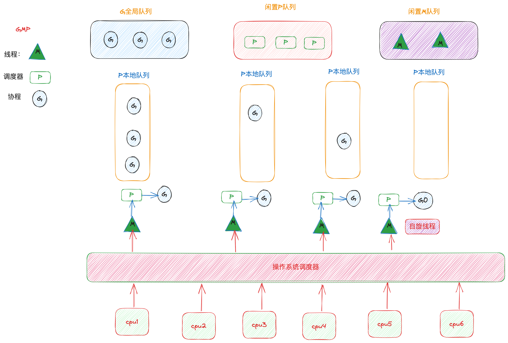

<!--more-->
## 进程线程协程
无论程序是用什么编程语言编写的，最终它都会在操作系统中运行。一个运行中的程序可以被视为一个进程，每个进程都有自己的内存空间和资源，且进程之间是相互隔离的。通常情况下，一个应用程序的功能并非单一，例如一个聊天应用，在进行语音通话的同时还可以进行文字聊天。那么，究竟是什么支撑着这些功能的运行呢？显然不是进程。这就引出了另一个概念：线程。线程是属于某个进程的，一个进程可以拥有多个线程，这些线程并发执行以支持进程的多个功能。进程和线程都是操作系统的基本单位或资源，多线程技术可以充分利用现代CPU的多核资源，以更高效地完成进程的多个任务。

进程-线程两级结构是当今大多数软件所采用的模式。然而，线程并非足够轻量。我们使用线程是为了让它完成某个具体任务，但线程除了完成任务本身所需的时间外，还有一些额外的开销，如线程切换。当线程因I/O或锁等原因阻塞时，就会发生线程切换。但这个切换过程并不是足够快，很多时候切换的耗时高于执行任务的耗时，导致CPU资源得不到充分利用。因此，我们需要一个更轻量级的执行单元，使得切换过程更加高效，从而充分利用CPU资源。拿go语言来说，Go语言通过实现协程（goroutine）和一套调度机制，为开发者提供了更轻量级的执行单元。协程相较于线程，需要保存的上下文内容更少，切换速度更快，因此能够充分高效地利用系统资源，提高系统并发度。

协程是用户级线程，它们由Go运行时（runtime）进行管理和调度，而非直接由操作系统管理。这使得Go运行时可以在较少的操作系统线程上调度大量的协程，降低了线程切换的开销。当一个协程因I/O或其他原因阻塞时，Go运行时会将其他协程调度到同一个操作系统线程上运行，从而实现高效的并发执行。

Go语言的协程模型使得编写高并发程序变得更加简单。通过使用关键字`go`，开发者可以轻松地创建一个新的协程并发执行函数。Go语言还提供了强大的并发原语，如通道（channel）和同步原语（如互斥锁和WaitGroup），以帮助开发者在协程之间进行安全的数据传递和同步。

Go语言通过实现协程和一套调度机制，为开发者提供了一种更轻量级、高效的并发编程模型，使得充分利用CPU资源和提高系统并发度成为可能。
## GMP调度机制
Go语言实现了一套高效的调度机制，在运行时管理和调度goroutine，而不是让操作系统直接管理。这种机制类似于“虚拟线程”的概念，Go在语言层面模拟了操作系统线程切换机制。

在传统的进程-线程二级结构中，一个线程隶属于某个固定的进程，一个进程可以拥有多个线程，形成1:M的模型。然而，在Go语言的GMP模型中，协程（G）和线程（M）之间形成了一个M:N的模型。这意味着一个协程并不是固定承载在一个线程上，而是可以在多个线程之间切换和轮转执行。这种模型允许更加高效地利用系统资源，提高并发性能。

GMP模型中的三个主要组件分别是：G（goroutine，协程）、M（machine，线程）和P（processor，处理器，不是指的cpu）。G表示协程，M表示操作系统线程，P表示Go运行时的调度器。在这个模型中，P负责将G调度到M上执行。一个P可以管理多个G，一个M可以关联到一个P。这种M:N的关系使得Go运行时可以在较少的操作系统线程上调度大量的协程，降低了线程切换的开销。

### G

### M
### P
### Scheduling
