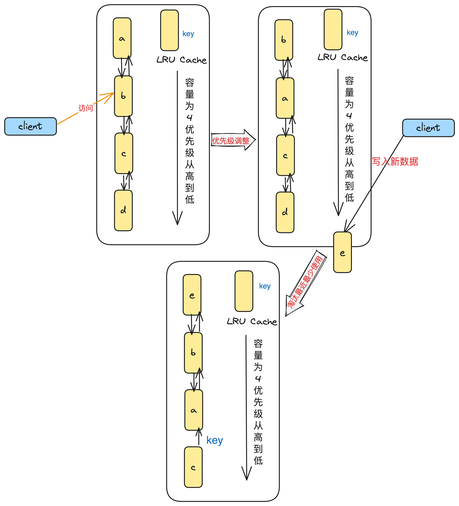
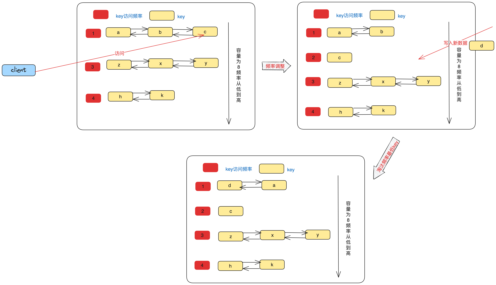

# LFU和LRU缓存淘汰算法


<!--more-->

## 前言
在日常开发过程中以及操作系统和许多开源项目中，为了提高性能，我们经常会使用缓存。缓存实际上是一种空间换时间的策略，通过将数据存储在快速访问的存储介质中，以减轻底层数据源的访问压力并提高系统性能。以日常开发为例，通常我们会将缓存数据存储在内存这种容量较小、速度快、价格较高的存储介质中。一个优秀的缓存系统通常需要考虑以下几个方面：

- 设置缓存占用内存空间上限，防止无限制增长导致服务内存溢出（OOM）。
- 分片策略，降低锁粒度。
- 选择合适的哈希算法，减少哈希碰撞。
- 使用singleflight策略，降低缓存击穿的风险。
- 采用合适的缓存淘汰策略，淘汰数据以释放存储空间。
- 设置缓存过期时间，减少内存空间占用并缩小数据不一致性的时间窗口。
- 使用高效的数据结构，平衡时间复杂度和空间复杂度。
- 监控告警，关注缓存击穿率和缓存命中率。
- 实现缓存持久化和预热。

本文将主要讨论两种常用的缓存淘汰策略的原理及其实现。
## 缓存淘汰算法
正如前面所提到的，为了避免内存溢出（OOM），缓存系统通常需要设置最大容量上限。这意味着缓存系统中存储的数据是有限的。假设我们现在有一个容量为10的缓存系统，任意时刻最多只有10条数据在缓存中。如果不考虑缓存设置过期时间，那么问题来了：是不是谁先占据这10个位置，其他数据就永远没有机会被放入缓存中？显然，这样的缓存系统并没有太大意义。

正如一个正常的社会应该有良好的阶级流动而非阶级固化一样，一个优秀的缓存系统中的数据也应该是流动的而非僵化的。为了实现这一目标，我们需要一种策略来清空部分数据，从而为新数据腾出空间。那么，我们应该如何淘汰数据呢？是随机淘汰，还是按照某种规则进行淘汰？这个策略就是本文要讨论的“缓存淘汰算法”。
### LRU
LRU（Least Recently Used，最近最少使用）是一种常用的缓存淘汰算法。它的核心思想是：当缓存空间不足时，优先淘汰最近最少使用的数据。LRU算法基于这样一个假设：最近访问过的数据在未来仍有较高的可能性被访问，因此应该将其保留在缓存中。

所谓“最近最少使用”，是指在一段时间内，某个数据相对于其他数据被访问的次数较少或者距离上次访问的时间较长。举个例子，假设你经常去北京、上海、天津和武汉这四个地方，但是最近一段时间你很长时间没有去武汉了。在这种情况下，武汉可以被视为“最近最少使用”的数据。对于缓存系统来说，它就会认为你好久没去武汉了，以后可能也不会去了，如果要去其它地方，那干脆把它从缓存中去掉吧，给新的数据腾位子。

这就是LRU缓存淘汰算法的基本思路。当缓存空间不足以容纳新数据时，它会选择最近最少使用的数据进行淘汰，从而为新数据腾出空间。这种策略有助于保留那些近期频繁访问的数据，从而提高缓存的命中率。当然，这种策略并非绝对准确，因为未来的访问模式可能会发生变化，但在实际应用中，LRU算法往往能够取得较好的性能。

为了实现这种效果，我们需要知道哪些数据是最近访问的，并按照某种顺序或权重记录缓存数据的优先级。当需要淘汰数据时，优先淘汰低优先级的数据。这就要求每次访问都需要让本次访问的数据优先级最高，避免被淘汰，实际上是一种贪心策略。

对于一个缓存系统来说，对外实际上主要提供两个能力：`get`和`set`。每次读取数据时，会将该数据的优先级设置为最高；每次写数据时，也会将数据放到最高优先级的位置。为了实现这一目标，我们通常会使用哈希表（HashMap），它能够在O(1)的时间复杂度内获取数据以及判断缓存是否存在。而对于要求数据通过优先级有序的场景，我们可以使用双链表这种数据结构。综合考虑，我们可以使用哈希表+双链表来实现LRU算法。

在这种实现中，哈希表负责快速查找缓存项，双链表负责维护缓存项的访问顺序。当访问或更新缓存时，我们可以在O(1)时间内通过哈希表找到对应的缓存项，然后将其移动到双链表的头部。当需要淘汰缓存时，我们可以直接移除双链表尾部的缓存项（最近最少使用的数据）。这样，我们就能在O(1)时间内完成缓存的读取、更新和淘汰操作，从而实现高效的LRU缓存淘汰算法。

#### 代码实现
```go
package main

import (
	"errors"
	"fmt"
	"sync"
)

func main() {
	const size = 20
	l := NewLRU(size)
	for i := 0; i < size+1; i++ {
		l.Add(fmt.Sprintf("%d", i+1), (i+1)*100)
	}
	fmt.Println(l.Get("3"))
	fmt.Println(l.Get("4"))
	fmt.Println(l.Get("5"))
	fmt.Println(l.Get("50"))
	l.Iterator()
	for i := 0; i < size+1; i++ {
		fmt.Printf("%p,%+v\n", l.dict[fmt.Sprintf("%d", i+1)], l.dict[fmt.Sprintf("%d", i+1)])
	}
}

var ErrNotExist = errors.New("not exist")

type LRU struct {
	head *listNode
	tail *listNode
	dict map[string]*listNode
	size int
	mu   sync.RWMutex
}

// NewLRU 新建一个LRU实例
func NewLRU(size int) *LRU {
	head := &listNode{}
	tail := &listNode{}
	head.right = tail
	tail.left = head
	return &LRU{
		head: head,
		tail: tail,
		dict: make(map[string]*listNode, size),
		size: size,
		mu:   sync.RWMutex{},
	}
}

func (l *LRU) Get(key string) (int, error) {
	l.mu.Lock()
	defer l.mu.Unlock()
	node := l.dict[key]
	if node == nil {
		return 0, ErrNotExist
	}

	l.cacheHit(node)

	return node.val, nil
}

func (l *LRU) Add(key string, val int) {
	l.mu.Lock()
	defer l.mu.Unlock()
	var newNode *listNode
	if _, ok := l.dict[key]; ok {
		newNode = l.dict[key]
		newNode.val = val

		l.cacheHit(newNode)
		return
	}
	newNode = &listNode{
		key: key,
		val: val,
	}
	var node *listNode
	if len(l.dict) >= l.size {
		node = l.tail.left
	}
	if node != nil {
		l.tail.left = node.left
		node.left.right = l.tail
		delete(l.dict, node.key)
	}
	newNode.right = l.head.right
	l.head.right.left = newNode
	newNode.left = l.head
	l.head.right = newNode

	l.dict[key] = newNode
}

func (l *LRU) cacheHit(node *listNode) {
	node.left.right = node.right
	node.right.left = node.left

	node.right = l.head.right
	l.head.right.left = node
	node.left = l.head
	l.head.right = node
}

// Iterator 遍历LRU
func (l *LRU) Iterator() {
	l.mu.Lock()
	defer l.mu.Unlock()
	t := l.head.right
	for ; t != l.tail; t = t.right {
		fmt.Printf("key:%d,val:%d ", t.key, t.val)
	}
	fmt.Println()
}

type listNode struct {
	left  *listNode
	right *listNode
	key   string
	val   int
}

```

### LFU
前面提到，假设你可能会经常访问北京、上海、天津和武汉这四个城市。有一段时间内没去武汉，使用LRU淘汰策略把这个数据从缓存中剔除。这看似合理，但实际上可能存在误伤。因为没去武汉的原因可能是以后不会再去了，也可能是这段时间内遇到了突发情况，比如买不到票或者武汉天气不太好。实际上，在最近这段时间之前，你去武汉的频率可能是最高的。在这种情况下，淘汰武汉这个数据可能并不合适。这就引申出另外一种缓存淘汰策略——LFU，它会记录每个数据的访问次数，并按照访问次数排序，将访问次数最低的数据视为低优先级数据。

LFU（Least Frequently Used，最不经常使用）是一种常用的缓存淘汰算法。它的核心思想是：当缓存空间不足时，优先淘汰访问频率最低的数据。LFU算法基于这样一个假设：访问频率较低的数据在未来被访问的可能性也较低，因此将其从缓存中移除。

为了实现LFU算法，我们需要记录每个数据项的访问频率。通常，可以使用哈希表来存储缓存项及其对应的访问频率。当访问或更新缓存时，我们需要更新对应数据项的访问频率。当需要淘汰缓存时，我们需要找到访问频率最低的数据项并将其移除。为了高效地找到访问频率最低的数据项，我们可以使用一种特殊的数据结构，如最小堆或者使用多个双链表，每个双链表代表一个访问频率，链表中的缓存项按照访问时间排序。

相较于LRU算法，LFU算法更加关注数据项的访问频率，而不仅仅是最近的访问时间。这使得LFU算法在某些场景下能够更好地预测未来的访问模式，从而提高缓存的命中率。然而，LFU算法的实现通常比LRU算法更复杂，且在数据访问频率分布较为平均的场景下，LFU算法的优势可能不会非常明显。


#### 代码实现
```go
package main

import (
	"fmt"
	"sort"
	"sync"
)

func main() {
	const size = 20
	l := NewLFU(size)
	for i := 0; i < size; i++ {
		l.Add(i+1, (i+1)*100)
	}
	fmt.Println(l.Get(3))
	fmt.Println(l.Get(4))
	fmt.Println(l.Get(5))
	fmt.Println(l.Get(4))
	l.Add(22, 2200)
	l.Add(23, 2300)
	l.Add(24, 2400)
	l.Add(23, 23000)
	// l.Iterator()
	const (
		shardNum          = 256
		eachShardCapacity = 1000
	)
	fmt.Println("======cache")
	cache := NewLocalCache(shardNum, eachShardCapacity)
	for i := 0; i < shardNum*eachShardCapacity; i++ {
		cache.Add(i+1, (i+1)*10)
	}

	for i := 0; i < shardNum && i*10+10 < shardNum; i++ {
		fmt.Println(len(cache.cacheList[i*10+10].dict))
	}
}

type LocalCache struct {
	cacheList []LFU
	shardNum  int
}

func NewLocalCache(shardNum int, eachSharCapacity int) LocalCache {
	cacheList := make([]LFU, shardNum)
	for i := 0; i < len(cacheList); i++ {
		cacheList[i] = NewLFU(eachSharCapacity)
	}
	return LocalCache{
		cacheList: cacheList,
		shardNum:  shardNum,
	}
}

func (l *LocalCache) Add(key, val int) {
	index := hash(key) % l.shardNum
	l.cacheList[index].Add(key, val)

}

func (l *LocalCache) Get(key int) int {
	index := hash(key) % l.shardNum
	return l.cacheList[index].Get(key)
}

// LFU is a structure for LFU cache.
type LFU struct {
	dict         map[int]*listNode // dict stores the key-value pairs.
	freqDict     map[int]*freqNode // freqDict stores the frequency of each key.
	minFrequency int               // minFrequency stores the minimum frequency.
	capacity     int               // capacity is the capacity of the cache.
	mu           sync.Mutex        // mu is used for ensuring thread safety.
}

// NewLFU creates a new LFU cache.
func NewLFU(capacity int) LFU {
	return LFU{
		dict:         make(map[int]*listNode, capacity),
		freqDict:     make(map[int]*freqNode, capacity),
		minFrequency: 0,
		capacity:     capacity,
		mu:           sync.Mutex{},
	}
}

// listNode is a node in the doubly linked list.
type listNode struct {
	left, right *listNode // left and right are pointers to adjacent nodes.
	key, val    int       // key and val are the key and value of the node.
	accessTimes int       // accessTimes is the number of times the node has been accessed.
}

// freqNode is a node in the frequency list.
type freqNode struct {
	head, tail *listNode // head and tail are pointers to the head and tail of the list.
	size       int       // size is the number of nodes in the list.
}

// Add adds a key-value pair to the cache.
func (l *LFU) Add(key, val int) {
	l.mu.Lock()         // Lock the cache.
	defer l.mu.Unlock() // Unlock the cache when the function returns.
	node, ok := l.dict[key]
	if ok {
		node.val = val
		l.hitIncrease(node)
		return
	}

	if len(l.dict) == l.capacity {
		freq := l.freqDict[l.minFrequency]
		minNode := freq.tail.left
		minNode.left.right = freq.tail
		freq.tail.left = minNode.left
		freq.size -= 1
		delete(l.dict, minNode.key)
		if freq.size == 0 {
			delete(l.freqDict, l.minFrequency)
		}
	}
	l.minFrequency = 1
	node = &listNode{
		key:         key,
		val:         val,
		accessTimes: 1,
	}
	freq, ok := l.freqDict[node.accessTimes]
	if !ok {
		freq = newFreqNode()
		l.freqDict[node.accessTimes] = freq
	}
	freq.size += 1
	freq.add(node)
	l.dict[key] = node
}

// Get gets the value of a key from the cache.
func (l *LFU) Get(key int) int {
	l.mu.Lock()         // Lock the cache.
	defer l.mu.Unlock() // Unlock the cache when the function returns.
	node, ok := l.dict[key]
	if !ok {
		return -1
	}
	l.hitIncrease(node)
	return node.val
}

// hitIncrease increases the access times of a node.
func (l *LFU) hitIncrease(node *listNode) {
	oldFreq := l.freqDict[node.accessTimes]
	oldFreq.size -= 1
	if oldFreq.size == 0 {
		delete(l.freqDict, node.accessTimes)
		if node.accessTimes == l.minFrequency {
			l.minFrequency += 1
		}
	}
	node.accessTimes += 1
	remove(node)
	newFreq, ok := l.freqDict[node.accessTimes]
	if !ok {
		newFreq = newFreqNode()
		l.freqDict[node.accessTimes] = newFreq
	}
	newFreq.size += 1
	newFreq.add(node)
}

// Iterator iterates over the cache and prints the key-value pairs.
func (l *LFU) Iterator() {
	l.mu.Lock()         // Lock the cache.
	defer l.mu.Unlock() // Unlock the cache when the function returns.
	tmp := make([]int, 0, len(l.freqDict))
	for k := range l.freqDict {
		tmp = append(tmp, k)
	}
	sort.Ints(tmp)
	for _, accessTimes := range tmp {
		freq := l.freqDict[accessTimes]
		p := freq.head.right
		fmt.Println("accessTimes:", accessTimes)
		for p != freq.tail {
			fmt.Printf("[key:%d,val:%d]->", p.key, p.val)
			p = p.right
		}
		fmt.Println("NULL")
	}
}

// newFreqNode creates a new frequency node.
func newFreqNode() *freqNode {
	head, tail := &listNode{}, &listNode{}
	head.right = tail
	tail.left = head
	return &freqNode{
		head: head,
		tail: tail,
	}
}

// add adds a node to the frequency node.
func (f *freqNode) add(node *listNode) {
	node.right = f.head.right
	f.head.right.left = node
	node.left = f.head
	f.head.right = node
}

// remove removes a node from the list.
func remove(node *listNode) {
	node.left.right = node.right
	node.right.left = node.left
}

func hash(key int) int {
	key ^= key >> 16
	key *= 0x85ebca6b
	key ^= key >> 13
	key *= 0xc2b2ae35
	key ^= key >> 16
	return key
}

```
