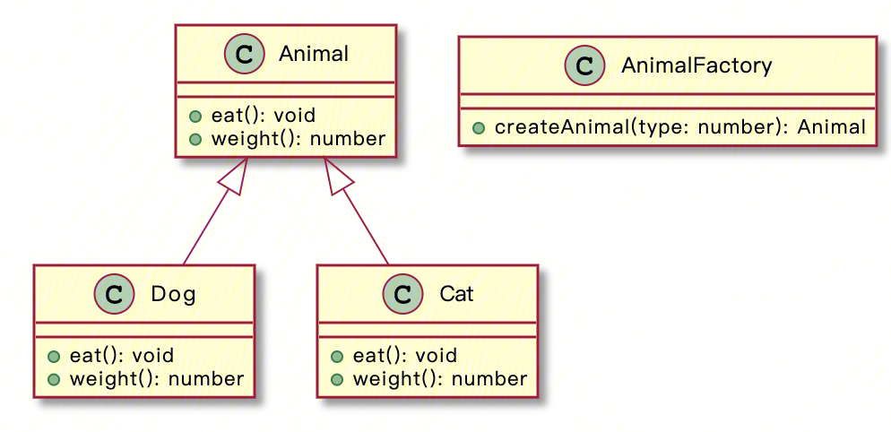
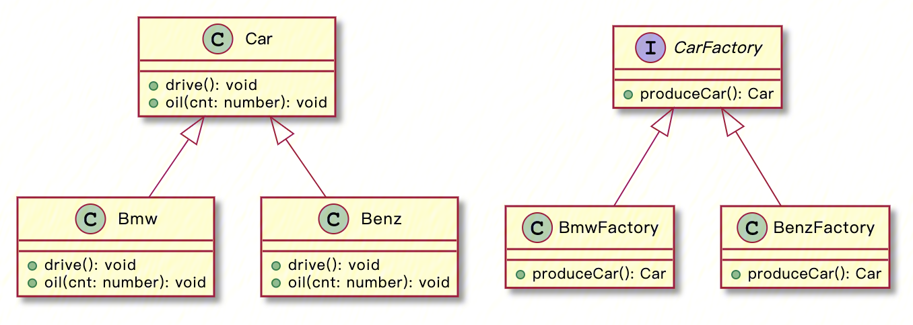
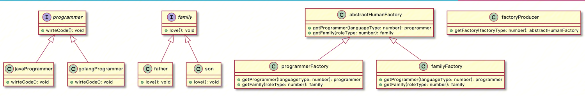

# Factory Pattern


The Factory Method pattern is a creational design pattern that provides a way to delegate the creation of objects to subclasses. In the Factory Method pattern, an abstract factory class defines an interface for creating objects, but the specific object creation is deferred to the subclasses.

## Simple Factory Pattern

> The Simple Factory pattern, also known as the Static Method pattern, defines a static method in the object creation factory class to create objects. The Simple Factory design pattern allows clients (users) to create the desired product instances without knowing the specific details of the objects. Users can directly use the created objects without worrying about how they are created.

**Class Diagram:**



**Code:**
```go
package main

import "fmt"

type Animal interface {
	eat()
	weight() int
}

type Dog struct {
}

func (d *Dog) eat() {
	fmt.Println("dog eat !")
}

func (d *Dog) weight() int {
	return 30
}

type Cat struct {
}

func (c *Cat) eat() {
	fmt.Println("cat eat!")
}

func (c *Cat) weight() int {
	return 10
}

type AnimalFactory struct {
}

func (a *AnimalFactory) newAnimal(animalType int) Animal {
	switch animalType {
	case 0:
		return &Dog{}
	case 1:
		return &Cat{}
	default:
		return nil
	}
}

func main() {
	factory := new(AnimalFactory)
	dog := factory.newAnimal(0)
	dog.eat()
	fmt.Println(dog.weight())

	cat := factory.newAnimal(1)
	cat.eat()
	fmt.Println(cat.weight())
}
```

As you can see, the Simple Factory pattern is quite simple. It separates the creation and usage of instances, allowing the users to create objects without knowing the details of the objects' creation process. It achieves separation and decoupling, where users only need to know the type mapping of the objects they want to create. However, what are the drawbacks of the Simple Factory pattern? When producing objects, the specific animal object to be created is determined based on the animal type passed in. As we add more animal types, such as rabbits or elephants, the `newAnimal` method will expand continuously. Moreover, whenever the animal types change, we have to modify this part of the code, which violates the Open-Closed Principle.

So, how can we address this issue? We can't really say that it solves the problem completely, but it can be considered as a programming technique. We can observe that the `newAnimal` method contains a lot of switch cases. How can we get rid of these switch cases? In the `main` function, when we need to create a specific animal object, we need to pass the `animalType` field and then call the `newAnimal` method to create the object. In other words, we create the object only when we need to use a certain animal object, which follows a "lazy loading" approach. If we create an instance of each animal whenever we add a new animal, and then put it into a map dictionary, we can simply fetch the object from the map without maintaining the `newAnimal` method. In essence, it transforms the "lazy loading" approach into an "eager loading" approach. Regardless of whether you use the object or not, if the object exists, we create an object instance and put it into the map dictionary. The code can be modified as follows:

```go
package main

import "fmt"

// Eager loading, register into the factory map
func init() {
	Register(0, &Dog{})
	Register(1, &Cat{})
}

type Animal interface {
	eat()
	weight() int
}

type Dog struct {
}

func (d *Dog) eat() {
	fmt.Println("dog eat !")
}

func (d *Dog) weight() int {
	return 30
}

type Cat struct {
}

func (c *Cat) eat() {
	fmt.Println("cat eat!")
}

func (c *Cat) weight() int {
	return 10
}

type AnimalFactory struct {
}

func Register(animalType int, animal Animal) {
	animals[animalType] = animal
}

func Get(animalType int) Animal {
	a, ok := animals[animalType]
	if !ok {
		return nil
	}
	return a
}

var animals = make(map[int]Animal) // animal type => Animal

func main() {
	dog := Get(0)
	dog.eat()
	fmt.Println(dog.weight())

	cat := Get(1)
	cat.eat()
	fmt.Println(cat.weight())
}
```

## Factory Method Pattern

> The Factory Method pattern, also known as the Polymorphic Factory pattern, is an upgraded version of the Simple Factory pattern. In the previous explanation, we discussed the Simple Factory pattern, where different types of animals, such as dogs and cats, were produced by the same animal factory. However, every time a new animal species is added, the animal factory needs to be modified accordingly. It's like needing to add matching tools every time a new animal species is produced, which is not very scalable. The Factory Method pattern can be seen as an improvement to the Simple Factory pattern, where different types of animals are no longer produced by the same animal factory. Instead, the production is further divided, and each type of animal has its own dedicated animal factory. Let's take the example of cars.

**Class Diagram:**


```go
package main

import "fmt"

// Car abstract interface for cars, defining two behaviors: drive and refuel
type Car interface {
	drive()
	refuel(cnt int)
}

// Bmw BMW car
type Bmw struct {
}

func (b *Bmw) drive() {
	fmt.Println("I'm driving a BMW!")
}

func (b *Bmw) refuel(cnt int) {
	fmt.Println("Adding", cnt, "liters of fuel to the BMW")
}

// Benz Benz car
type Benz struct {
}

func (b *Benz) drive() {
	fmt.Println("I'm driving a Benz!")
}

func (b *Benz) refuel(cnt int) {
	fmt.Println("Adding", cnt, "liters of fuel to the Benz")
}

// CarFactory interface for car factories, responsible for car production
type CarFactory interface {
	makeCar() Car
}

// BmwFactory BMW car factory, producing BMW cars
type BmwFactory struct {
}

func (b *BmwFactory) makeCar() Car {
	return new(Bmw)
}

// BenzFactory Benz car factory, producing Benz cars
type BenzFactory struct {
}

func (b *BenzFactory) makeCar() Car {
	return new(Benz)
}

func main() {
	bmwFactory := new(BmwFactory)
	bmw := bmwFactory.makeCar()
	bmw.drive()
	bmw.refuel(1)

	benzFactory := new(BenzFactory)
	benz := benzFactory.makeCar()
	benz.drive()
	benz.refuel(2)
}
```

In summary, let's highlight the advantages and disadvantages of the Factory Method pattern:

**Advantages:**

1. Good scalability: When a new product (e.g., adding an Audi car) needs to be added, there is no need to modify the abstract factory or the interface provided by the abstract factory. Only a specific factory and product need to be added. This approach aligns with the "Open-Closed Principle." In contrast, the Simple Factory pattern requires modification of the factory class's conditional logic.

2. Adheres to the Single Responsibility Principle: Each specific factory class is only responsible for producing the corresponding product. The Simple Factory pattern's factory class requires additional logical checks.

3. The key to the Factory Method pattern lies in the polymorphism design based on the factory and product roles. It allows the factory to independently determine which product object to create (the product's factory class only needs to implement the abstract factory interface). The details of how to create the object are completely encapsulated within the specific factory. The Factory Method pattern is also referred to as the "Polymorphic Factory" pattern because all specific factory classes have the same abstract parent class.

**Disadvantages:**

1. Every time a new product is added, new concrete product classes need to be written, along with providing the corresponding factory classes,When the number of products in the system becomes large, the number of classes increases exponentially, resulting in increased system complexity. Additionally, multiple classes need to be compiled and executed, which adds to the system's overhead.

2. A specific factory class can only create one specific product.

## Abstract Factory Pattern

> The Abstract Factory pattern can be understood as a factory of factories, where there is a super factory that produces other factories. As Marx said, "Man is the sum of all social relations." A person cannot play only one role in society. A person's occupation could be a programmer, and they also have corresponding family roles. Likewise, a programmer could specialize in languages such as Go, Java, or Python, and their family roles could be a father, son, or husband. Together, these roles constitute the sum of social relations. The Abstract Factory pattern can be seen as a combination of the Simple Factory pattern and the Factory Method pattern. It inherits their respective advantages and disadvantages.

**Class Diagram:**


**Code:**

```go
package main

import "fmt"

type programmer interface {
	writeCode()
}

type javaProgrammer struct {
}

func (j *javaProgrammer) writeCode() {
	fmt.Println("I am a Java programmer. I write Java.")
}

type goProgrammer struct {
}

func (g *goProgrammer) writeCode() {
	fmt.Println("I am a Golang programmer. I write Go.")
}

type family interface {
	love()
}

type father struct {
}

func (f *father) love() {
	fmt.Println("I am a father. I love my wife and my son.")
}

type son struct {
}

func (s *son) love() {
	fmt.Println("I am a son. I love my father and my mother.")
}

type programmerFactory struct {
}

func (p *programmerFactory) getProgrammer(programmerType int) programmer {
	switch programmerType {
	case 0:
		return new(javaProgrammer)
	case 1:
		return new(goProgrammer)
	default:
		return nil
	}
}

func (p *programmerFactory) getFamily(roleType int) family {
	return nil
}

type familyFactory struct {
}

func (f *familyFactory) getFamily(roleType int) family {
	switch roleType {
	case 0:
		return new(father)
	case 1:
		return new(son)
	default:
		return nil
	}
}

func (f *familyFactory) getProgrammer(programmerType int) programmer {
	return nil
}

type abstractHumanFactory interface {
	getFamily(roleType int) family
	getProgrammer(programmerType int) programmer
}

type factoryProducer struct {
}

func (*factoryProducer) getFactory(factoryType int) abstractHumanFactory {
	switch factoryType {
	case 0:
		return new(programmerFactory)
	case 1:
		return new(familyFactory)
	default:
		return nil
	}
}

func main() {
	fac := new(factoryProducer)

	programmerFac := fac.getFactory(0)

	java := programmerFac.getProgrammer(0)
	java.writeCode()

	golang := programmerFac.getProgrammer(1)
	golang.writeCode()

	familyFac := fac.getFactory(1)

	f := familyFac.getFamily(0)
	f.love()

	s := familyFac.getFamily(1)
	s.love()
}
```

## Summary

The Factory pattern is the simplest and most easily understandable design pattern, and it is widely used in daily development. It can be roughly divided into three types. Correctly using design patterns in our code can greatly simplify the code, reduce code coupling, and improve maintainability (after all, it is a summary of previous experiences). However, it is essential to avoid the misuse of design patterns. Improper use can have adverse effects. Don't use design patterns just for the sake of using them!


