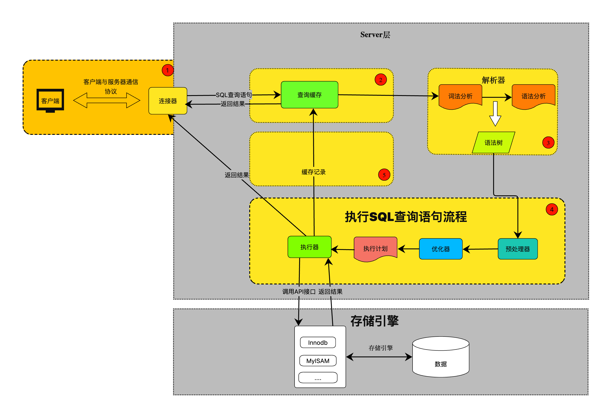

# Core Concepts of MySQL


<!--more-->

# MySQL
Introduction to the core concepts of MySQL and their underlying implementation, all based on the MySQL InnoDB storage engine.

## SQL Statement Execution Process
When we start learning SQL, the first thing we usually learn is the select statement. Here's a simple query:
```SQL
// Retrieve a record with id=1 from the student table
select * from student where id=1;
```
What is the complete process involved in executing this SQL statement? "What does MySQL do internally when executing this simple SQL statement?" With these questions in mind, let's dive into MySQL and explore its internal architecture.

Let's start by looking at the execution process of an SQL statement from a global perspective. The diagram below illustrates the entire flow of a SQL statement, from the client to the data storage, including the modules within the MySQL architecture.



We can see that MySQL is divided into two layers: the `Server layer` and the `storage engine layer`.
- The `Server layer` is responsible for establishing client connections, analyzing, optimizing, and executing SQL statements. The Server layer is independent of the storage engine. It encompasses the core modules of MySQL, including the connector, parser, preprocessor, optimizer, and executor. Additionally, MySQL's built-in functions and all cross-storage engine features are implemented in the Server layer.
- The `storage engine layer` is responsible for data retrieval and storage. There are multiple storage engines available, with InnoDB, MyISAM, and Memory being common ones. These engines provide the same interface to the Server layer but have different specific implementations. In this article, we will mainly focus on the InnoDB storage engine, which is also the default storage engine in MySQL. Familiar concepts in MySQL, such as indexes, transactions, and locks, are implemented at the storage engine layer. InnoDB uses B+ tree indexes, and primary key indexes, composite indexes, and regular indexes created in database tables all use B+ tree indexes.

The above description provides an overview of the overall architecture of MySQL, which can be considered "not too complex." It consists of the Server layer and the storage engine layer. Let's now delve into the specific details.

### Connector

If you want to perform CRUD operations on MySQL, the first step is to establish a connection with MySQL. Generally, the following command is used to establish a connection with the MySQL service:
```shell
# -h specifies the hostname or IP address
# -u specifies the username
# -p specifies the password, for security reasons it is generally not hard-coded and is manually entered in the console after executing the command
mysql -h ip -u user -p
For example:
mysql -h 192.168.1.111 -u root -p
```
Since MySQL's transport layer protocol is based on TCP, the process of establishing a connection requires the TCP three-way handshake. If the MySQL server is running properly, after establishing the TCP connection, it will verify if the username and password are correct. If the username or password is incorrect, an error will be reported: `Access denied for user`. If the username and password are correct, the connector will query the permissions associated with that user based on the username. It will save the permissions in memory, and until the connection is closed, even if the administrator modifies the user's permissions, it will not affect the permissions for the current connection. The new permissions will be used only when the next connection is established. During the current connection's lifecycle, all read and write operations for the user will be based on the permissions saved in memory during authentication.

You can use the following command to view the current connections established with the MySQL server:
```MySQL
mysql> show processlist;
+----------+------+--------------------+-------------+---------+------+-------+------------------+
| Id       | User | Host               | db          | Command | Time | State | Info             |
+----------+------+--------------------+-------------+---------+------+-------+------------------+
| 10773010 | root | 10.99.17.131:21086 | NULL        | Sleep   |  210 |       | NULL             |
| 10773094 | root | 10.99.17.131:23980 | mysql_learn | Sleep   |   72 |       | NULL             |
| 10773150 | root | 10.99.17.131:25924 | NULL        | Query   |    0 | init  | show processlist |
+----------+------+--------------------+-------------+---------+------+-------+------------------+
3 rows in set (0.02 sec)
```
You can see that three users with the username "root" have established connections with the MySQL service. Among them, the user with Id 10773010 has an empty database (`db`) and the value of `Command` is "Sleep", indicating that the user has not executed any other commands after connecting and has been idle for 210 seconds (`Time` column).

> Does this idle time keep increasing indefinitely? In other words, does the MySQL connection stay open continuously?

Certainly not. It is not possible for a connection to be established a year ago and for MySQL to keep it active while I haven't done anything (just like making a reservation at a restaurant and if you don't show up within a certain time, they will cancel it). MySQL also has a similar mechanism. If a connection remains idle for a long time without any activity, it will automatically be closed after a certain period of time. This maximum idle time is controlled by the `wait_timeout` parameter, which defaults to 2 * 60 * 60 = 7200 seconds.
```MySQL
mysql> show variables like 'wait_timeout';
+---------------+-------+
| Variable_name | Value |
+---------------+-------+
| wait_timeout  | 7200  |
+---------------+-------+
1 row in set (0.03

 sec)
```
If we find a connection undesirable, we can also manually kill that connection using the `kill connection +Id` command. If I want to kill the connection with Id 10773010, I simply execute the following command:
```MySQL
mysql> kill connection +10773010;
Query OK, 0 rows affected (0.02 sec)

mysql> show processlist;
+----------+------+--------------------+-------------+---------+------+-------+------------------+
| Id       | User | Host               | db          | Command | Time | State | Info             |
+----------+------+--------------------+-------------+---------+------+-------+------------------+
| 10773094 | root | 10.99.17.131:23980 | mysql_learn | Sleep   |  895 |       | NULL             |
| 10773150 | root | 10.99.17.131:25924 | NULL        | Query   |    0 | init  | show processlist |
+----------+------+--------------------+-------------+---------+------+-------+------------------+
2 rows in set (0.03 sec)

mysql>
```
You can see that the connection with Id 10773010 has been killed.

> Can you establish an unlimited number of connections with the MySQL server?

Just like any resource, there is a limit to the number of connections that MySQL can handle. MySQL's connections are valuable resources, so it cannot and should not provide an unlimited number of connections. Similar to the maximum idle time controlled by the `wait_timeout` parameter, the maximum number of connections is controlled by the `max_connections` parameter.

```MySQL
mysql> show variables like 'max_connections';
+-----------------+-------+
| Variable_name   | Value |
+-----------------+-------+
| max_connections | 2500  |
+-----------------+-------+
1 row in set (0.03 sec)
```
For example, if the maximum number of connections for my MySQL server is 2500, it means that at any given moment, it can only maintain a maximum of 2500 connections. If this limit is exceeded, the system will reject subsequent connection requests and an error will be reported: `Too many connections`.

We know that HTTP protocol is based on TCP, and it has both persistent connections (long connections) and non-persistent connections (short connections). Similarly, MySQL also has long connections and short connections.
- Long connections: As the name suggests, these are connections with a long lifespan. After the client establishes a connection with MySQL, the connection is not immediately released after each SQL statement is executed. Instead, it is kept alive, allowing reuse for subsequent SQL statements without the need to reconnect.
- Short connections: As the name suggests, these are connections with a short lifespan. After the client establishes a connection with MySQL, the connection is immediately released after each SQL statement is executed. The next SQL statement requires a new connection to be established.

```shell
# Long connection
Establish TCP connection and connect to MySQL
Execute SQL1
Execute SQL2
Execute SQL3
....
Execute SQLn
Close the connection by completing the TCP four-way handshake with MySQL.

# Short connections
Establish TCP connection and connect to MySQL
Execute SQL1
Close the connection by completing the TCP four-way handshake with MySQL.

Establish TCP connection and connect to MySQL
Execute SQL2
Close the connection by completing the TCP four-way handshake with MySQL.

Establish TCP connection and connect to MySQL
Execute SQL3
Close the connection by completing the TCP four-way handshake with MySQL.
....
Establish TCP connection and connect to MySQL
Execute SQLn
Close the connection by completing the TCP four-way handshake with MySQL.
```
It is evident that both long connections and short connections have their advantages and disadvantages.
The advantage of long connections is that they reuse resources without reconnecting for each SQL statement, which can reduce the execution time of SQL statements (by eliminating the three-way handshake process for establishing connections). However, the disadvantage is that connections that are not released for a long time occupy system resources. Accumulating too many long connections may cause MySQL to run out of memory (OOM). Therefore, the maximum number of connections should not be set too high.
The advantage of short connections is that the connection is released immediately after each SQL statement, reducing the load on the MySQL system. However, the disadvantage is that each SQL statement requires a new connection, which increases the execution time of SQL statements.

In practical development, it is generally recommended to use long connections because they reduce the overhead of establishing and terminating connections. However, having too many long connections can lead to high system load in MySQL, resulting in service disruptions and restarts.

> Long connections that are not released for a long time can consume a significant amount of memory in the MySQL system. How can this be resolved?

There are several common approaches to address this issue:

1. `Set reasonable timeout values`: When establishing long connections between the MySQL server and clients, setting appropriate timeout values is important. By configuring the `wait_timeout` and `interactive_timeout` parameters, you can control the automatic closure of connections that have been idle for a certain period. This ensures that long inactive connections are released, freeing up related resources.

2. `Use connection pooling`: Utilizing connection pooling is a common solution. Connection pooling manages a pool of pre-established connections and allocates them to clients as needed. By reusing connections, it avoids frequent creation and destruction of connections, thus reducing resource consumption. Connection pooling often provides connection management and monitoring features, allowing you to configure parameters such as the maximum number of connections and timeout durations based on your requirements.

3. `Explicitly close connections`: When writing application code, ensure that connections are explicitly closed when they are no longer needed. This ensures timely release of connections after usage, avoiding prolonged resource occupation. Close connections at appropriate times, such as after request processing or when a session ends, to actively release associated resources.

4. `Optimize the usage of database connections`: Analyzing and optimizing the way database connections are used can also reduce resource consumption. For example, minimize the number of concurrent connections, use connection pooling for connection management, and control the lifecycle of connections appropriately. Avoid unnecessary long idle connections and minimize unnecessary connection overhead.

5. `Periodically restart the MySQL service`: Periodic restarts of the MySQL service can help clean up resources and reset the system state, reducing the load issues that arise after prolonged operation. However, this approach should be carefully considered as restarts may interrupt ongoing operations and affect system availability.

To summarize, these approaches help address the issue of long connections in the connector process. The process involves:
- Establishing a connection through TCP three-way handshake.
- Verifying client credentials.
- Storing the user's permissions for the connection's lifespan.

When reusing connections, administrators can use the FLUSH PRIVILEGES statement to force-refresh the permission table, ensuring that long-established connections use updated permission data for subsequent operations.

### Query Cache
After establishing a connection, the client can send SQL statements to the MySQL server for execution. Upon receiving an SQL statement, the MySQL server first determines whether it is a query statement (based on whether the first field of the SQL statement is "SELECT"). If it is a query statement, MySQL checks the query cache to see if there is a cached result for this SQL statement. If a cached result exists, it is directly returned to the client without further processing. The cache is stored in a key-value format, where the key is the SQL query statement and the value is the query result.

While this caching mechanism seems promising, there are concerns regarding cache hit rates and efficiency. In general, MySQL's query cache has a high invalidation rate because any data update in the MySQL table will invalidate the cache. For example, if we execute the following query:

```MySQL
SELECT * FROM student WHERE id=1;
```

After the first execution of this query, MySQL caches the result for `id=1`. However, if MySQL performs an update statement, the cache will be invalidated. For instance, if MySQL updates the data for `id=2`:

```MySQL
UPDATE student SET name='张三' WHERE id=2;
```

One might wonder why MySQL takes such a blunt approach. After all, updating `id=2` should not affect the result for `id=1`. However, MySQL does not have knowledge of whether updating `id=2` would impact the record for `id=1`, or the cost of determining the impact is too high (difficult to assess). To ensure data consistency, MySQL simply invalidates the cache whenever there is an update operation.

From the analysis above, it appears that the query cache has limited utility. Even in scenarios where there are more reads than writes, complete avoidance of writes is not feasible. As long as there is a write operation, all caches for the table become invalidated, incurring significant costs. Therefore, starting from version 8.0, MySQL has removed the query cache feature.

### Parser
For an SQL statement to be executed successfully, it must first comply with the SQL syntax rules defined by MySQL. These rules can be understood as the mutually agreed-upon guidelines between us and MySQL. We adhere to these rules when writing SQL statements, and similarly, MySQL follows these rules to parse and execute the SQL statements we write. It is not feasible for us to provide MySQL with arbitrary strings and expect it to execute them. Before executing an SQL statement, MySQL needs to understand the purpose of the statement, whether it is an insert, delete, update, or select operation, as well as the tables and fields involved in the SQL statement. This information can be extracted based on the syntax rules, which is essentially the task of the parser.

The parser performs two main tasks:

1. Syntax Analysis: MySQL checks whether the SQL statement has any syntax errors based on the agreed-upon syntax rules. If there are syntax errors, MySQL will directly report an error, such as "You have an error in your SQL syntax". For example, if we execute the following statement:

```MySQL
mysql> slect * from friend where id=1;
ERROR 2013 (HY000): Lost connection to MySQL server during query
No connection. Trying to reconnect...
Connection id:    10788396
Current database: mysql_learn

ERROR 1064 (42000): You have an error in your SQL syntax; check the manual that corresponds to your MySQL server version for the right syntax to use near 'slect * from friend where id=1' at line 1
mysql>
```

Here, we mistakenly typed `slect` instead of `select`. MySQL checks the SQL statement against the syntax rules and identifies that it does not conform to the syntax. As a result, it reports an error. This process is similar to the parameter validation commonly used in backend development.

2. Lexical Analysis: Regardless of the complexity of an SQL statement, it always follows certain patterns. For example, the keyword `where` is always followed by a query condition, and the keyword `from` is followed by a table name. MySQL implements a lexical analyzer that extracts table names, SQL types, field names, and query conditions from the SQL statement. This preparation work is then passed on to the subsequent modules for further processing.

It's important to note that while syntax checking and lexical analysis are performed by the parser, the verification of table names and field names' existence is not handled at the parser level. This can be understood as the parser layer being focused on local logic and not involving network or API calls.

### Preprocessor
Once an SQL statement is parsed, it can be determined that the statement is potentially executable. However, this doesn't guarantee its successful execution. Parsing the SQL statement ensures that the syntax is correct and extracts key information such as table names, but it doesn't verify if the SQL statement can be executed successfully. For example, if the SQL statement refers to a table that doesn't exist, it won't be executed successfully. The preprocessor performs two main tasks:

1. Checking the Existence of Tables and Fields: The preprocessor checks whether the table names and field names extracted by the parser exist. This step involves reading table information and verifying the existence of table names and field names. If any of the referenced tables or fields don't exist, an error is returned.

2. Replacing `*` with Actual Field Names: The preprocessor replaces the `*` symbol (which denotes selecting all fields) with the actual field names of the table. This step is necessary to determine the specific fields to be retrieved from the table.

Unlike the parser, the preprocessor step involves more than just local logic. During the preprocessing phase, it requires reading table information and potentially making API calls to check the existence of tables and fields. 

If we execute the following SQL statement and encounter an error, it is actually returned by the preprocessor:

```MySQL
mysql> select * from frined where id=1;
ERROR 1146 (42S02): Table 'mysql_learn.frined' doesn't exist
mysql>
```

In this example, the preprocessor identifies that the table name `frined` doesn't exist, leading to an error indicating the table doesn't exist in the specified database.

### Optimizer
After the SQL statement goes through the parser and preprocessor, it reaches the optimizer. Strictly speaking, at this point, it can no longer be called an SQL statement because it has been significantly transformed. The optimizer's role is crucial because it selects an optimal execution plan based on the SQL statement and the actual data in the tables. For example, if a query has multiple indexes, the optimizer analyzes and determines which index to use based on the estimated cost. Additionally, if the table has a small amount of data, a full table scan might be more efficient than using an index.

To understand the execution plan of a query, we often use the `EXPLAIN` command. By adding the `EXPLAIN` keyword before the `SELECT` statement, we can see the execution plan.

**Query 1:**
```MySQL
mysql> explain select * from `like` where id=1;
+----+-------------+-------+------------+-------+---------------+---------+---------+-------+------+----------+-------+
| id | select_type | table | partitions | type  | possible_keys | key     | key_len | ref   | rows | filtered | Extra |
+----+-------------+-------+------------+-------+---------------+---------+---------+-------+------+----------+-------+
|  1 | SIMPLE      | like  | NULL       | const | PRIMARY       | PRIMARY | 4       | const |    1 |   100.00 | NULL  |
+----+-------------+-------+------------+-------+---------------+---------+---------+-------+------+----------+-------+
1 row in set, 1 warning (0.04 sec)

mysql>
```

**Query 2:**
```MySQL
mysql> explain select * from `like` limit 1;
+----+-------------+-------+------------+-------+---------------+---------------------+---------+------+------+----------+-------------+
| id | select_type | table | partitions | type  | possible_keys | key                 | key_len | ref  | rows | filtered | Extra       |
+----+-------------+-------+------------+-------+---------------+---------------------+---------+------+------+----------+-------------+
|  1 | SIMPLE      | like  | NULL       | index | NULL          | uk_user_id_liker_id | 8       | NULL |    3 |   100.00 | Using index |
+----+-------------+-------+------------+-------+---------------+---------------------+---------+------+------+----------+-------------+
1 row in set, 1 warning (0.03 sec)

mysql>
```

In the above examples, the `key` column is not empty. In Query 1, MySQL chooses to use the `PRIMARY` key index, while in Query 2, it uses the `uk_user_id_liker_id` unique index. If the `key` column is empty, it means that no index is used, and a full table scan is performed.

In practice, even for identical SQL statements, the execution plan may vary depending on various factors, including indexes and the size of table data. In summary, MySQL's optimizer selects a relatively optimal execution plan based on several conditions to minimize the execution cost of SQL statements.

### Executor
After the preceding steps, we finally come to the actual execution of the SQL statement. The executor acts as a bridge between the MySQL server layer and the storage engine layer. The executor doesn't execute the SQL statement directly; instead, it passes the processed "SQL statement" to the storage engine through API interfaces. It then waits for the storage engine to return the execution results, which are then passed back to the query cache and the connector.

## Indexes

## Three Main Logs
### Undo Log
### Redo Log
### Binary Log

## Locks

## Transactions
### Atomicity
### Durability
### Isolation
### Consistency

## Data Structures

## Memory
