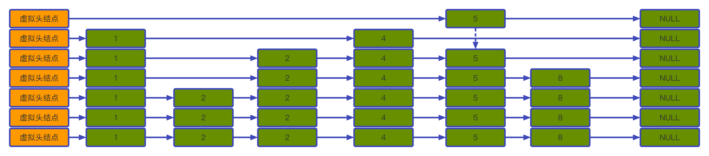

# zset分析与实现


## 概念
跳表是一种很特殊的数据结构，可以把跳表理解为一个多层链表，每一层都是一个有序链表，链表之间通过指针连接，并且最底层的那个链表保存跳表完整的元素，跳表示意图如下：

可以看到除了最后一层链表，每一层链表元素都有可能缺失。

小结一下跳表的基本特征：
- 每一层都是一个按照结点的score有序的链表
- 链表结点key全局唯一，score可以相同
- 不同层链表相同结点之间通过指针相连
- 最底层链表含有跳表所有元素

由此可以抽象化出跳表的数据结构：
```go
// skipList 跳表数据结构
// Data 链表结点数据
// next 指向下一个节点指针，同一层链表结点按照Score非递减
// down，与下一层连接指针，当前节点p p!=nil&&p.down!=nil 满足 p.Data==p.down.Data
type skipList struct {
	Data Data
	next *skipList
	down *skipList
}
// Data 数据类型
type Data *Element

// Element 链表结点格式
// Key: zSet的成员key，全局唯一
// Score: zSet的成员对应的分数，可以一样
type Element struct {
	Key   string
	Score int
}

```
## 插入流程

## 删除流程
## 更新流程
## 查询流程
## 代码实现
## 实际应用 


